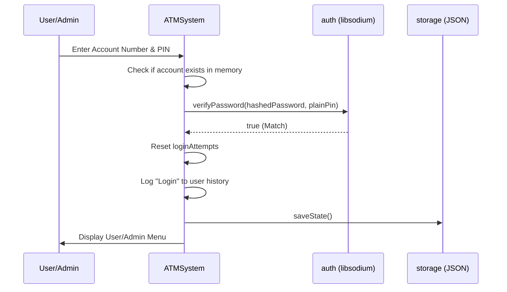
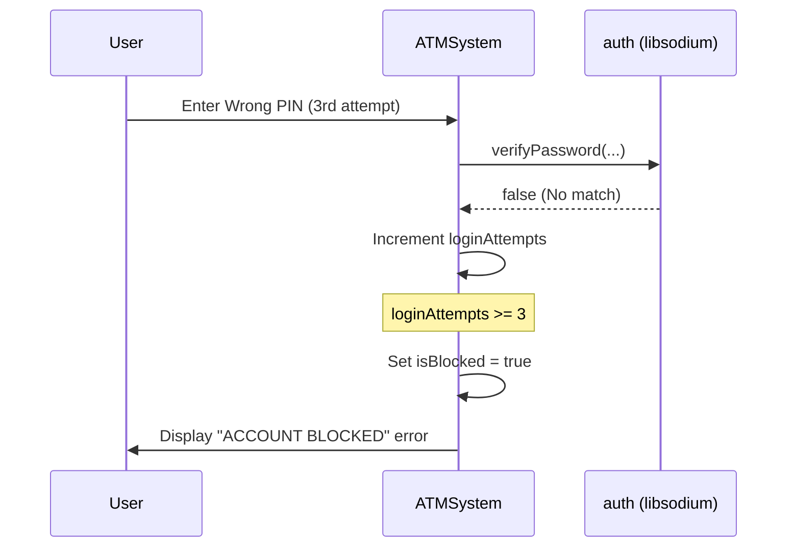
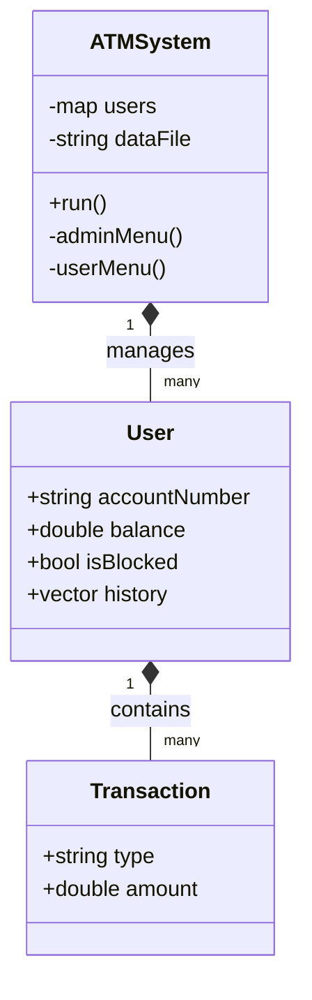

# ATM System - UML Documentation

This document contains visual representations of the system architecture and logic using Mermaid syntax. These diagrams complement the automatically generated Class Diagrams in the Doxygen documentation.

## 1. Use Case Diagram

Describes the interactions between actors (User and Administrator) and the system.

```mermaid
useCaseDiagram
    actor "Bank User" as User
    actor "Administrator" as Admin

    package "ATM System" {
        usecase "Login" as UC1
        usecase "Check Balance" as UC2
        usecase "Deposit Funds" as UC3
        usecase "Withdraw Funds" as UC4
        usecase "View History" as UC5
        usecase "Logout" as UC6
        
        usecase "Create New Account" as UC7
        usecase "Reset User PIN" as UC8
        usecase "Unlock Account" as UC9
        usecase "List All Accounts" as UC10
        usecase "Initial Setup" as UC11
    }

    User --> UC1
    UC1 <.. UC2 : <<include>>
    UC1 <.. UC3 : <<include>>
    UC1 <.. UC4 : <<include>>
    UC1 <.. UC5 : <<include>>
    UC1 <.. UC6 : <<include>>

    Admin --> UC1
    UC1 <.. UC7 : <<include>>
    UC1 <.. UC8 : <<include>>
    UC1 <.. UC9 : <<include>>
    UC1 <.. UC10 : <<include>>
    
    Admin --> UC11 : "If no admin exists"
```

## 2. Sequence Diagram - Successful Login

Shows the flow of information during the login process.



## 3. Sequence Diagram - Account Lockout



## 4. Class Diagram (Simplified Architecture)

For detailed, interactive class diagrams including all members and relations, please refer to the **Class Hierarchy** section in the generated Doxygen documentation.


