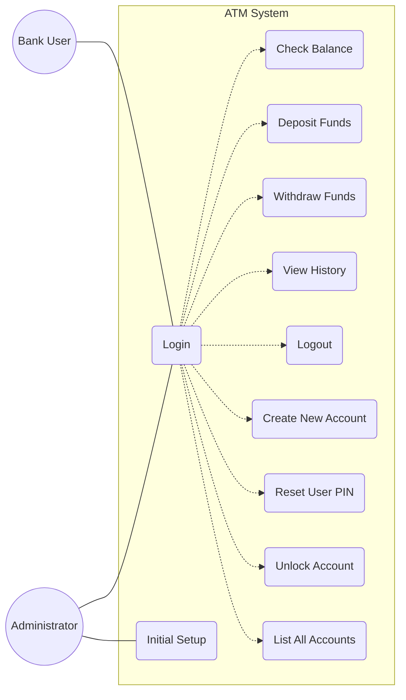
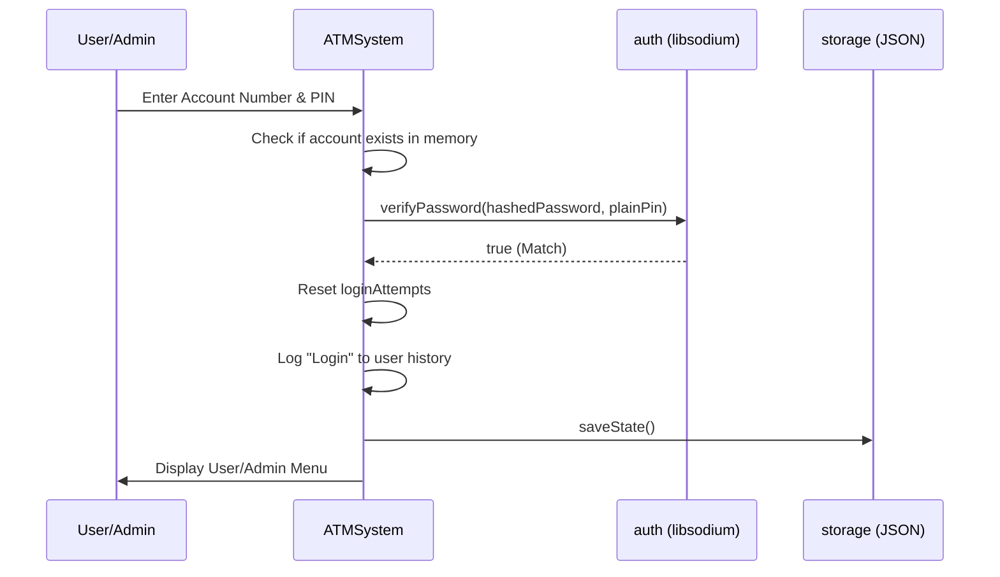
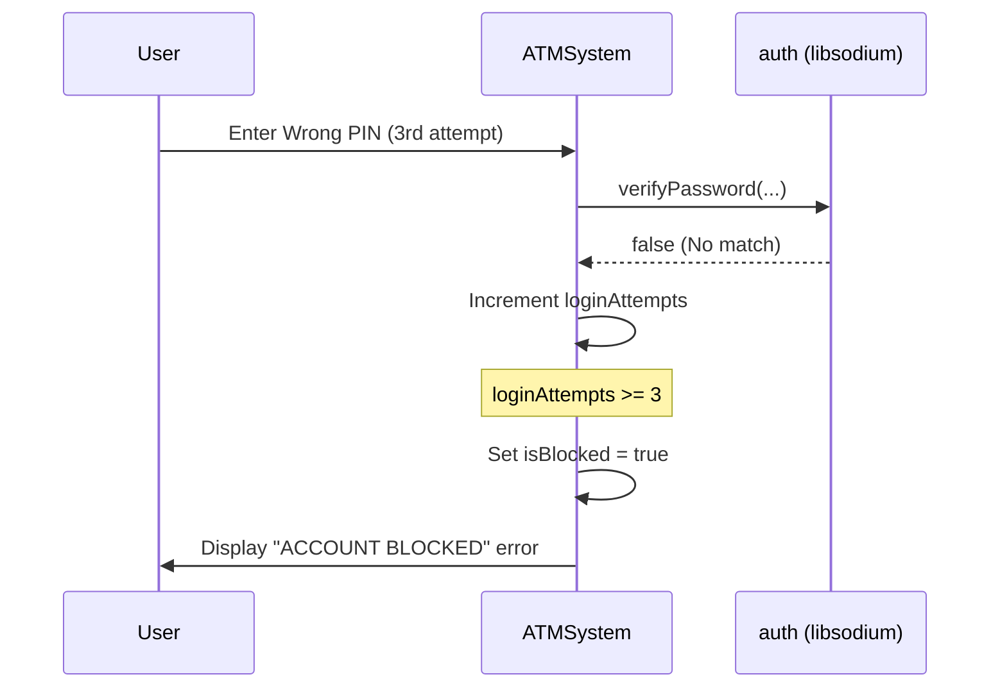
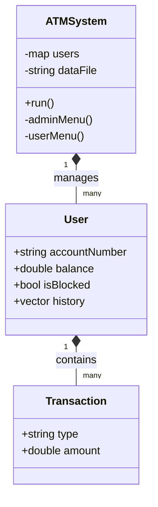

# ATM System - UML Documentation

This document contains visual representations of the system architecture and logic using Mermaid syntax.

## 1. Use Case Diagram

Describes the interactions between actors (User and Administrator) and the system.

## 2. Sequence Diagram - Successful Login

## 3. Sequence Diagram - Account Lockout

## 4. Class Diagram (Simplified)

*Note: For detailed, interactive class diagrams generated from code, see the "Classes" section in Doxygen.*

